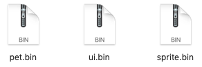
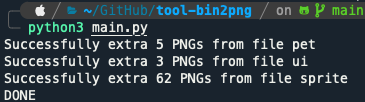
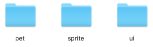
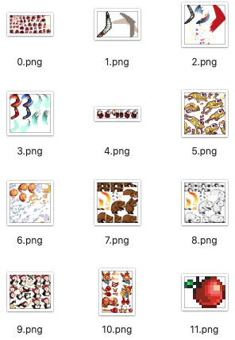

# 🖼 Bin to PNG

Bin to PNG is a tool for extracting PNG images from bin files. 

## 💡 Introduction

For some reasons we get some `bin` files, which are compiled PNG files. Now we want to extra them from bin files. 

There were many excellent games in Symbian period, most of such games with quite small size. To do this, developers always chose to compile picture materials from PNG format to bin format, and then archive them to Jar package for running. 

For now, if we want to extract some picture sources from those games, we have to extract PNGs from bin files. Here is a tool to help you do that. 

## ⚙️ Requirement 

``` Python
Python packages: os, re, binascii
```

## 🔧 How to use

**Step 1**: [Clone](https://github.com/cbhua/tool-bin2png.git) or [Download](https://github.com/cbhua/tool-bin2png/archive/main.zip) this repository;

**Step 2**: Put all `.bin` files you want to extract to the folder `/bin`;



**Step 3**: Use Python to run the `main.py`: `python3 main.py`;



**Step 4**: Check the results: each `.bin` file will be extracted to a separated folder with the same name. 



## 📊 Examples

When you cloned or downloaded this repository, there are already three examples within the `./bin` folder. And also the results within the `./png` folder. 



## 📜 Licence

[MIT Licence](https://opensource.org/licenses/mit-license.php)